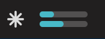
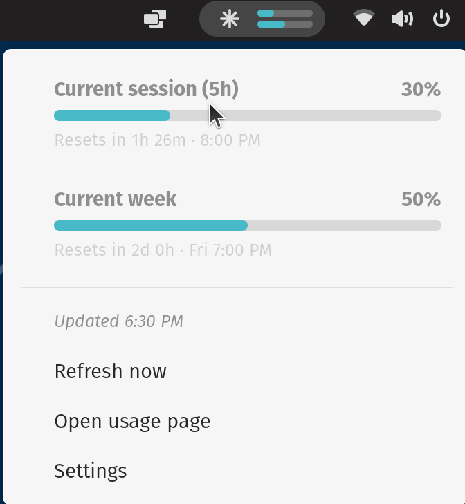

# Claude Code Meter

A GNOME Shell extension for Pop!_OS 22.04 that shows your Claude Code usage in the top bar.





- **Top bar:** two mini bars next to a spark icon — session (5-hour) on top, week below.
- **Dropdown:** session and weekly usage with percentages, progress bars and reset times,
  plus *Refresh now*, *Open usage page* and *Settings*.
- **Settings:** a GTK 3 window that follows the Pop theme (what the top bar shows,
  refresh interval, warning/critical colour thresholds).

Bars are Pop teal, turn amber at 75% and red at 90% (configurable).

## Requirements

- Pop!_OS 22.04 (GNOME Shell 42). Other GNOME 42 desktops should work too.
- Claude Code installed and logged in with a Claude subscription
  (the meter reads `~/.claude/.credentials.json`).
- `git`, `make`, `glib-compile-schemas` and Python 3 with PyGObject. On Pop!_OS these are
  normally already installed; if not:

  ```sh
  sudo apt install git make libglib2.0-bin python3-gi
  ```

## Install

```sh
git clone https://github.com/Cocoawerks/claude-meter.git
cd claude-meter
make enable
```

`make enable` compiles the settings schema, copies the extension to
`~/.local/share/gnome-shell/extensions/claude-meter@cbruno.linux` and enables it.

Then restart GNOME Shell so it loads the extension:

- **X11** (Pop!_OS default): press **Alt+F2**, type `r`, press **Enter**.
- **Wayland:** log out and back in.

The meter appears on the right side of the top bar.

> If `make enable` says the extension doesn't exist, that's because GNOME hasn't seen it yet.
> Restart the shell as above, then run `gnome-extensions enable claude-meter@cbruno.linux`
> (or turn it on in the Extensions app).

## Update

```sh
cd claude-meter
git pull
make install
```

Then restart GNOME Shell again. GNOME 42 can't reload an extension's code while it's running.

## Uninstall

```sh
cd claude-meter
make uninstall
```

## Other make targets

| Command        | What it does                                         |
| -------------- | ---------------------------------------------------- |
| `make`         | Compile the GSettings schema only                    |
| `make install` | Compile and copy to the extensions folder            |
| `make enable`  | `install`, then enable the extension                 |
| `make zip`     | Build `claude-meter@cbruno.linux.zip` for sharing    |
| `make clean`   | Remove the compiled schema and zip                   |

## Settings

Open **Settings** from the meter's dropdown. The Extensions app's own settings button
opens an Adwaita-styled version instead, because that app uses libadwaita, which ignores
the Pop GTK theme.

## How it works

Every few minutes (5 by default) the extension reads your Claude Code access token from
`~/.claude/.credentials.json` and asks Anthropic's usage endpoint
(`https://api.anthropic.com/api/oauth/usage`) for your session and weekly utilisation, the
same numbers Claude Code's `/usage` shows. The token is only sent to Anthropic. The
extension never refreshes or changes your login.

That endpoint is internal and undocumented, so it could change. If it does, the meter
shows an error in the dropdown instead of wrong numbers.

## Troubleshooting

- **`!` in the top bar:** open the dropdown to see the error. *Login expired* means you
  should open Claude Code so it refreshes your login. *Not signed in* means run `claude`
  and log in.
- **Check the logs:**

  ```sh
  journalctl -b -o cat _COMM=gnome-shell | grep -iE 'claude-meter|JS ERROR'
  ```
